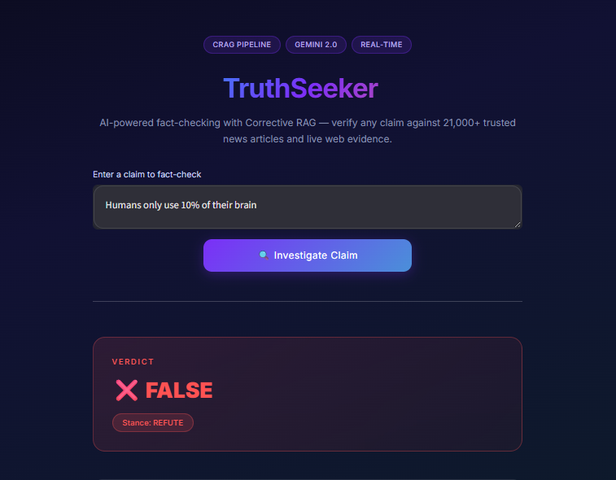
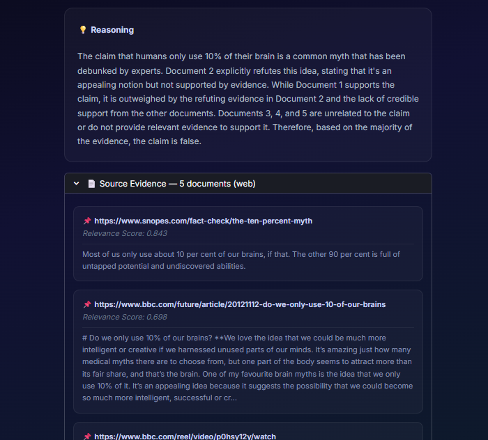
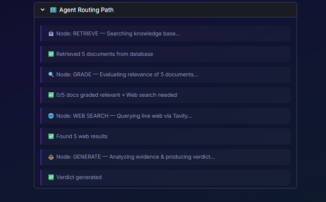

# 🔍 TruthSeeker

**AI-Powered Fact-Checking System using Corrective Retrieval-Augmented Generation (CRAG)**

[](https://python.org)
[](https://langchain-ai.github.io/langgraph/)
[](https://streamlit.io)
[](https://supabase.com)
[](https://groq.com)

---

## 📌 Overview

TruthSeeker is an intelligent fact-checking application that verifies user claims against a knowledge base of **21,000+ verified news articles** and **live web evidence**. It implements a **Corrective RAG (CRAG)** pipeline — a 4-node LangGraph state machine that retrieves evidence, self-grades document relevance, falls back to live web search when needed, and delivers structured verdicts.

### Key Features

- 🧠 **Corrective RAG Pipeline** — Self-healing retrieval that detects irrelevant results and auto-corrects via web search
- ⚖️ **Structured Verdicts** — Every claim receives a **TRUE**, **FALSE**, or **UNVERIFIABLE** verdict with stance detection and reasoning
- 🌐 **Live Web Fallback** — Queries trusted sources (Reuters, BBC, AP News, Snopes, PolitiFact) when the knowledge base is insufficient
- 📊 **Transparent Routing** — Full visibility into the agent's decision path (retrieve → grade → search → generate)
- 🎨 **Premium UI** — Dark-themed Streamlit interface with glassmorphism, gradient accents, and animated verdict cards
- ☁️ **Cloud-Ready** — Deployable to Streamlit Community Cloud with Supabase as the managed backend

---

## 🖼️ Screenshots

| Main Interface | Evidence-Backed Verdict | Agent Routing Log |
|:-:|:-:|:-:|
|  |  |  |

---

## 🏗️ System Architecture

```
┌─────────────────────────────────────────────────────────────────┐
│                        USER INTERFACE                           │
│                    (Streamlit — app.py)                          │
│   Claim Input  →  Verdict Card  →  Evidence  →  Routing Log    │
└──────────────────────────┬──────────────────────────────────────┘
                           │
                           ▼
┌─────────────────────────────────────────────────────────────────┐
│                    CRAG PIPELINE (graph.py)                      │
│                   LangGraph State Machine                        │
│                                                                  │
│   ┌──────────┐    ┌────────────────┐    ┌──────────────────┐    │
│   │ RETRIEVE  │───▶│ GRADE DOCUMENTS │───▶│     GENERATE     │    │
│   │          │    │                │    │                  │    │
│   │ Supabase │    │  LLM Relevance │    │  Stance + Verdict │    │
│   │ pgvector │    │    Filtering   │    │   + Reasoning    │    │
│   └──────────┘    └───────┬────────┘    └──────────────────┘    │
│                           │ (irrelevant)         ▲              │
│                           ▼                      │              │
│                    ┌──────────────┐               │              │
│                    │  WEB SEARCH   │───────────────┘              │
│                    │  (Tavily API) │                              │
│                    └──────────────┘                              │
└─────────────────────────────────────────────────────────────────┘
                           │
                           ▼
┌─────────────────────────────────────────────────────────────────┐
│                     DATA LAYER                                   │
│                                                                  │
│   Supabase (PostgreSQL + pgvector)                               │
│   ├── documents table (content, metadata, embedding)             │
│   ├── IVFFlat index for cosine similarity                        │
│   └── match_documents() RPC function                             │
│                                                                  │
│   Sentence-Transformers (all-MiniLM-L6-v2)                       │
│   └── 384-dimensional embeddings                                 │
└─────────────────────────────────────────────────────────────────┘
```

---

## 🔄 Pipeline Flow (Step-by-Step)

### Node 1 — Retrieve
> Embeds the user's claim using `all-MiniLM-L6-v2` and performs **cosine similarity search** against the Supabase vector store. Returns the **top-5 most similar** document chunks.

### Node 2 — Grade Documents
> An LLM (Llama 3.3 70B via Groq) evaluates each retrieved document for **relevance** to the claim. Documents are graded in a single batch call. If fewer than **2 documents** are deemed relevant, the pipeline triggers a web search fallback.

### Node 3 — Web Search *(conditional)*
> When the knowledge base doesn't provide sufficient evidence, **Tavily API** searches the live web — prioritizing trusted fact-checking and news domains:
> - `reuters.com`, `apnews.com`, `bbc.com`
> - `snopes.com`, `factcheck.org`, `politifact.com`
>
> Web results are merged with any relevant database documents.

### Node 4 — Generate
> The LLM performs **stance detection** (SUPPORT / REFUTE / NEUTRAL) and generates a structured verdict:
> - **VERDICT:** TRUE / FALSE / UNVERIFIABLE
> - **STANCE:** SUPPORT / REFUTE / NEUTRAL
> - **REASONING:** 2–4 sentence explanation
>
> The system is also date-aware — it injects the current system date to accurately evaluate time-relative claims.

### Conditional Routing

```
grade_documents ──→ web_search_needed == "yes" ──→ web_search ──→ generate ──→ END
                 └─→ web_search_needed == "no"  ──→ generate ──→ END
```

---

## 📁 Project Structure

```
TruthSeeker/
├── src/                         # Core application source code
│   ├── app.py                   # Streamlit frontend (premium dark UI)
│   ├── graph.py                 # CRAG pipeline — LangGraph state machine (4 nodes)
│   ├── ingest.py                # Data ingestion: CSV → chunks → embeddings → Supabase
│   ├── config.py                # Shared config loader (.env + Streamlit secrets)
│   └── __init__.py
│
├── db/                          # Database setup
│   └── supabase_setup.sql       # pgvector extension, table, index, and RPC function
│
├── data/                        # Dataset (excluded from git — too large)
│   └── True.csv                 # 21,000+ verified true news articles (Kaggle)
│
├── assets/                      # Screenshots for documentation
│   ├── Interface.png            # Main claim input interface
│   ├── Evidence-Backed.png      # Verdict with source evidence
│   └── Log.png                  # Agent routing path visualization
│
├── tests/                       # Test scripts
│   └── test_graph.py            # Graph compilation smoke test
│
├── docs/                        # Reports and documentation
│   └── TruthSeeker_Project_Report.pdf
│
├── .streamlit/                  # Streamlit Cloud configuration
│   └── secrets.toml.example     # Template for cloud deployment secrets
│
├── .env                         # API keys (not in git)
├── .gitignore
├── requirements.txt             # Python dependencies
└── README.md
```

---

## 🛠️ Tech Stack

| Technology | Role | Details |
|---|---|---|
| **LangGraph** | Orchestration | State machine / graph execution engine for the CRAG pipeline |
| **Groq** (Llama 3.3 70B) | LLM Inference | Ultra-fast inference for grading, stance detection, and verdict generation |
| **Supabase + pgvector** | Vector Database | PostgreSQL-based vector store with cosine similarity search via IVFFlat index |
| **Sentence-Transformers** | Embeddings | `all-MiniLM-L6-v2` model producing 384-dimensional embeddings |
| **Tavily API** | Web Search | Real-time search engine with domain filtering for trusted news sources |
| **Streamlit** | Frontend | Interactive web UI with custom CSS, glassmorphism design, and animated components |
| **LangChain** | Text Processing | `RecursiveCharacterTextSplitter` for document chunking + prompt templates |
| **pandas** | Data Loading | CSV ingestion and preprocessing of the news dataset |

---

## 🚀 Getting Started

### Prerequisites

| Requirement | Purpose |
|---|---|
| Python 3.9+ | Runtime |
| [Supabase](https://supabase.com) account | Vector database backend |
| [Groq](https://console.groq.com) API key | LLM inference (free tier available) |
| [Tavily](https://tavily.com) API key | Live web search fallback |

### 1. Clone the Repository

```bash
git clone https://github.com/hassanali241/truthseeker.git
cd truthseeker
```

### 2. Install Dependencies

```bash
pip install -r requirements.txt
```

### 3. Configure Environment Variables

Create a `.env` file in the project root:

```env
SUPABASE_URL=https://your-project.supabase.co
SUPABASE_KEY=your-supabase-anon-key
GROQ_API_KEY=your-groq-api-key
TAVILY_API_KEY=your-tavily-api-key
```

### 4. Set Up the Vector Database

1. Go to your **Supabase Dashboard → SQL Editor → New Query**
2. Paste the contents of [`db/supabase_setup.sql`](db/supabase_setup.sql) and run it
3. This creates:
   - The `vector` extension (pgvector)
   - A `documents` table with `content`, `metadata`, and `embedding` columns
   - An IVFFlat index for fast cosine similarity search
   - A `match_documents()` RPC function

### 5. Ingest the Dataset

Download the [Fake and Real News Dataset](https://www.kaggle.com/datasets/clmentbisaillon/fake-and-real-news-dataset) from Kaggle. Extract `True.csv` into the `data/` folder, then run:

```bash
python src/ingest.py
```

> ⏱️ **Note:** Ingestion processes 21,000+ articles → chunks them (500 chars, 50 overlap) → generates embeddings → batch inserts into Supabase. This takes approximately **10–20 minutes**.

### 6. Launch the Application

```bash
streamlit run src/app.py
```

The app will open at `http://localhost:8501`.

---

## ☁️ Deploying to Streamlit Cloud

1. Push your code to GitHub (ensure `.env` is in `.gitignore`)
2. Go to [share.streamlit.io](https://share.streamlit.io) and connect your repository
3. Set the main file path to `src/app.py`
4. Add your secrets under **Settings → Secrets** in TOML format:

```toml
SUPABASE_URL = "https://your-project.supabase.co"
SUPABASE_KEY = "your-supabase-anon-key"
GROQ_API_KEY = "your-groq-api-key"
TAVILY_API_KEY = "your-tavily-api-key"
```

The app's `config.py` automatically reads from `st.secrets` when deployed on Streamlit Cloud, and from `.env` when running locally.

---

## 🗄️ Database Schema

### `documents` Table

| Column | Type | Description |
|---|---|---|
| `id` | `BIGSERIAL` (PK) | Auto-incrementing primary key |
| `content` | `TEXT` | Chunked article text (500 chars max) |
| `metadata` | `JSONB` | Source index, subject, date, title, chunk info |
| `embedding` | `VECTOR(384)` | all-MiniLM-L6-v2 embedding vector |

### `match_documents()` RPC Function

```sql
match_documents(query_embedding VECTOR(384), match_count INT, filter JSONB)
→ RETURNS TABLE (id, content, metadata, similarity)
```

Uses cosine distance (`<=>` operator) to find the most similar documents.

---

## 🧪 Testing

Run the graph compilation smoke test:

```bash
python src/graph.py
```

This builds the CRAG pipeline, compiles it, and runs a sample claim through all 4 nodes — verifying that retrieval, grading, routing, and generation work end-to-end.

---

## 📄 Documentation

| Document | Description |
|---|---|
| [`TruthSeeker_Project_Report.pdf`](docs/TruthSeeker_Project_Report.pdf) | Detailed project report covering methodology, architecture, and evaluation |

---

## 🤝 Contributing

1. Fork the repository
2. Create a feature branch (`git checkout -b feature/your-feature`)
3. Commit your changes (`git commit -m 'Add your feature'`)
4. Push to the branch (`git push origin feature/your-feature`)
5. Open a Pull Request

---

## 📜 License

This project is developed as part of an academic AI project. Please refer to the repository for licensing details.

---

## 👤 Author

**Hassan Ali** — AI Engineer

[](https://github.com/hassanali241)
[](https://www.linkedin.com/in/hassan-ali-46a58b28a/)

---

<p align="center">
  <strong>TruthSeeker v1.0</strong> — Corrective RAG Fact-Checking System<br>
  Built with LangGraph · Groq · Supabase · Tavily · Streamlit
</p>
